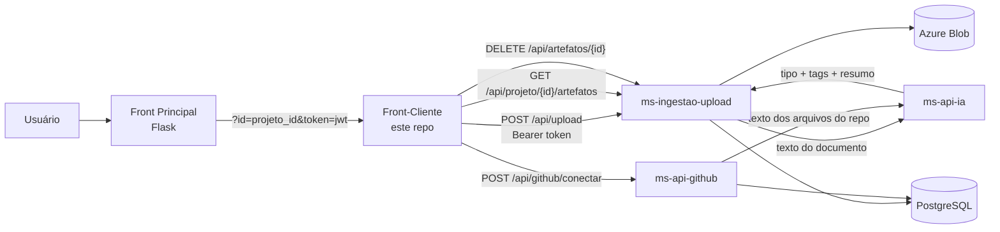

# DocuIA — Front-Cliente do Projeto

Front-end web em **FastAPI + Jinja2** que entrega as telas de **dados do projeto** dentro da plataforma DocuIA: integração com GitHub, upload de documentos e listagem de arquivos processados pela IA. Não é o "shell" da aplicação — quem hospeda login, dashboard, empresas e a lista de projetos é o **Front Principal** (Flask, repositório separado). Este front é aberto a partir do detalhe de um projeto, recebendo `projeto_id` e `token` via query string.

## O que este repositório entrega

Três telas, todas embaixo de `/projeto/...`:

| Rota | Tela | O que faz |
|---|---|---|
| `GET /projeto/github` | Repositórios GitHub | Conecta um repositório (público ou privado com PAT) ao `ms-api-github` para análise automática por IA. |
| `GET /projeto/upload` | Upload de Documentos | Envia PDFs/DOCX/imagens/diagramas direto para o `ms-ingestao-upload`, que extrai texto, classifica via `ms-api-ia`, persiste no Postgres e no Azure Blob. |
| `GET /projeto/arquivos` | Arquivos Processados | Lista os artefatos do projeto vindos do `ms-ingestao-upload`, com busca, filtros, preview (resumo + tags da IA) e exclusão. |

Todas as chamadas a microsserviços são feitas **direto do navegador** com `Authorization: Bearer <token>` (o token JWT vem do front principal e fica em `localStorage`). O backend FastAPI deste repo só renderiza templates e injeta as URLs dos microsserviços.

## Ecossistema DocuIA

A plataforma DocuIA é uma arquitetura de microsserviços para documentação inteligente de projetos. Componentes:

| Componente | Stack | URL default | Papel |
|---|---|---|---|
| **Front Principal** | Flask | `https://docuia-frontend-hdc8hzfqbqebc6cp.brazilsouth-01.azurewebsites.net` | Login, cadastro, dashboard, empresas, projetos, perfil. Shell da aplicação. |
| **Front-Cliente (este repo)** | FastAPI + Jinja2 | local / `uvicorn` | Telas de dados do projeto (github / upload / arquivos). |
| **ms-ingestao-upload** | FastAPI | `https://docuia-api-upload.azurewebsites.net` | Recebe upload, extrai texto, dispara IA, grava metadados no Postgres e arquivo no Blob. |
| **ms-api-ia** | FastAPI | `https://docuia-api-ia.azurewebsites.net` | Classifica documentos: recebe texto → devolve `tipo_classificado`, `tags`, `resumo`. |
| **ms-api-github** | FastAPI | `https://docuia-api-github.azurewebsites.net` | Conecta repositórios GitHub e dispara análise. |
| **PostgreSQL** | — | gerenciado | Persistência dos artefatos (metadados, classificação, vínculo com projeto/usuário). |
| **Azure Blob Storage** | — | gerenciado | Armazena os arquivos físicos enviados. |

### Fluxo do usuário



O usuário começa pelo front principal, escolhe uma empresa, escolhe um projeto e, ao clicar em **Upload de Dados** (ou GitHub / Arquivos), é redirecionado para este front-cliente com `id` e `token` na query string. O `static/js/sessao.js` lê esses parâmetros, valida o JWT no client (assinatura é validada no server a cada chamada) e remove a query string da URL.

## Stack

- **Python 3.12+**
- **FastAPI** — framework web
- **Uvicorn** — ASGI server
- **Jinja2** — templates HTML
- **httpx** — cliente HTTP (healthcheck dos microsserviços)
- **python-dotenv** — carrega `.env`
- Front: HTML + CSS + JS vanilla (sem bundler, sem framework)

## Estrutura de pastas

```
Frontend_Projeto_Microservicos/
├── main.py                       # entrypoint FastAPI: rotas e healthcheck
├── requirements.txt
├── README.md
├── static/
│   ├── css/
│   │   ├── style.css             # estilo geral + páginas do projeto
│   │   └── sidebar.css           # sidebar canônica (alinhada ao front principal)
│   ├── js/
│   │   ├── sessao.js             # captura projeto_id/token, valida JWT
│   │   ├── projeto_github.js
│   │   ├── projeto_upload.js
│   │   └── projeto_arquivos.js
│   └── assets/
│       └── images/               # ícones da sidebar (PNG)
└── templates/
    ├── interface/
    │   └── sidebar.html          # partial reutilizável (active_page = "projetos")
    └── projeto/
        ├── projeto_github.html
        ├── projeto_upload.html
        └── projeto_arquivos.html
```

## Variáveis de ambiente

| Variável | Default | Para que serve |
|---|---|---|
| `UPLOAD_API_URL` | `https://docuia-api-upload.azurewebsites.net` | Base do `ms-ingestao-upload`. Injetada em `window.API.UPLOAD`. |
| `IA_API_URL` | `https://docuia-api-ia.azurewebsites.net` | Base do `ms-api-ia`. Injetada em `window.API.IA`. |
| `GITHUB_API_URL` | `https://docuia-api-github.azurewebsites.net` | Base do `ms-api-github`. Injetada em `window.API.GITHUB`. |
| `FRONT_PRINCIPAL_URL` | `https://docuia-frontend-hdc8hzfqbqebc6cp.brazilsouth-01.azurewebsites.net` | Base do Front Principal — usada nos links da sidebar (Dashboard, Empresas, Projetos, Perfil) e no botão "Voltar para Projetos". |
| `LOGIN_URL` | `${FRONT_PRINCIPAL_URL}/login` | Para onde redirecionar quando o token estiver ausente ou expirado. |

### `.env` de exemplo

```dotenv
UPLOAD_API_URL=https://docuia-api-upload.azurewebsites.net
IA_API_URL=https://docuia-api-ia.azurewebsites.net
GITHUB_API_URL=https://docuia-api-github.azurewebsites.net
FRONT_PRINCIPAL_URL=https://docuia-frontend-hdc8hzfqbqebc6cp.brazilsouth-01.azurewebsites.net
LOGIN_URL=https://docuia-frontend-hdc8hzfqbqebc6cp.brazilsouth-01.azurewebsites.net/login
```

Se uma variável não estiver definida, o `main.py` usa o default acima (URL pública do serviço na Azure).

## Como rodar localmente

```bash
# 1. clonar
git clone https://github.com/andretozi/Frontend_Projeto_Microservicos.git
cd Frontend_Projeto_Microservicos

# 2. ambiente virtual
python -m venv .venv
# Windows
.venv\Scripts\activate
# Linux/macOS
source .venv/bin/activate

# 3. dependências
pip install -r requirements.txt

# 4. .env (use o exemplo acima)
# (no Windows, copie manualmente; no Linux/macOS: cp .env.example .env)

# 5. servir
uvicorn main:app --reload --host 127.0.0.1 --port 5000
```

Acesse: `http://127.0.0.1:5000`

> ⚠️ As páginas exigem `?id=<projeto_id>&token=<jwt>` na query string na primeira navegação (o JWT vem do front principal). Sem isso, o `sessao.js` redireciona para o `LOGIN_URL`. Para testar isoladamente, gere um JWT válido a partir do front principal.

## Rotas servidas por este front

| Método | Rota | Template |
|---|---|---|
| GET | `/` | `projeto/projeto_github.html` (alias da aba GitHub) |
| GET | `/projeto/github` | `projeto/projeto_github.html` |
| GET | `/projeto/upload` | `projeto/projeto_upload.html` |
| GET | `/projeto/arquivos` | `projeto/projeto_arquivos.html` |
| GET | `/healthcheck` | JSON com status dos microsserviços |

### Healthcheck

`GET /healthcheck` faz uma chamada HTTP (timeout 3s) para cada microsserviço configurado e devolve:

```json
{
  "frontend": "ok",
  "upload_api": "ok",
  "ia_api": "ok",
  "github_api": "ok"
}
```

Cada chave assume `"ok"` quando a resposta HTTP tem status < 500, ou `"down"` em caso de falha, timeout ou erro 5xx.

## Integração com outros repos — contratos de API consumidos

Tudo é chamado **do browser** com `Authorization: Bearer <token>`.

### ms-ingestao-upload (`UPLOAD_API_URL`)

- **`POST /api/upload`** — multipart/form-data
  - Campos: `projeto_id` (int), `documento` (file)
  - Resposta: 200/201 em sucesso. O serviço extrai texto, chama o `ms-api-ia`, salva no Postgres e no Blob.
  - Consumido em: `static/js/projeto_upload.js`.

- **`GET /api/projeto/{projeto_id}/artefatos`**
  - Resposta esperada:
    ```json
    {
      "artefatos": [
        {
          "id": 1,
          "nome_arquivo": "spec.pdf",
          "tipo": "Especificação Técnica",
          "tags": ["upload", "Repositório docuia/api"],
          "resumo": "Documento técnico que descreve...",
          "data_upload": "2026-05-23T10:30:00",
          "url_documento": "https://.../blob/.../spec.pdf"
        }
      ]
    }
    ```
  - Consumido em: `static/js/projeto_arquivos.js`.

- **`DELETE /api/artefatos/{artefato_id}`**
  - Resposta esperada: 200 ou 204.
  - Consumido em: `static/js/projeto_arquivos.js`.

### ms-api-github (`GITHUB_API_URL`)

- **`POST /api/github/conectar`** — `application/json`
  - Body:
    ```json
    {
      "projeto_id": 1,
      "url": "https://github.com/usuario/repo",
      "is_private": false,
      "token": null,
      "sincronizar": false
    }
    ```
  - Consumido em: `static/js/projeto_github.js`. Em sucesso, o usuário é redirecionado para `/projeto/arquivos`.

### ms-api-ia (`IA_API_URL`)

Este front **não chama** o `ms-api-ia` diretamente — quem chama é o `ms-ingestao-upload` e o `ms-api-github` ao processar documentos. A URL fica disponível em `window.API.IA` apenas para uso futuro.

## Convenções

- Todo CSS vive em `static/css/`. Há dois arquivos: `style.css` (geral + páginas) e `sidebar.css` (componente da sidebar). Não usar blocos `<style>` inline nos templates.
- Todo JavaScript vive em `static/js/`. Exceção: o pequeno bloco `<script>` que expõe `window.API` no topo de cada página.
- Sidebar é incluída via ``. Cada página define `` antes do include — nas 3 páginas deste repo o valor é `"projetos"`.
- URLs de microsserviços nunca são hardcoded — vêm de variáveis de ambiente no backend Python e de `window.API` no JavaScript.
- IDs e `onclick`s no HTML são contratos com o JS — não renomear sem atualizar o arquivo `.js` correspondente.